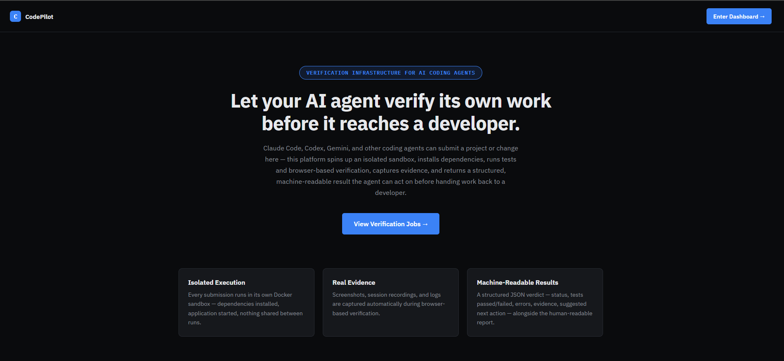
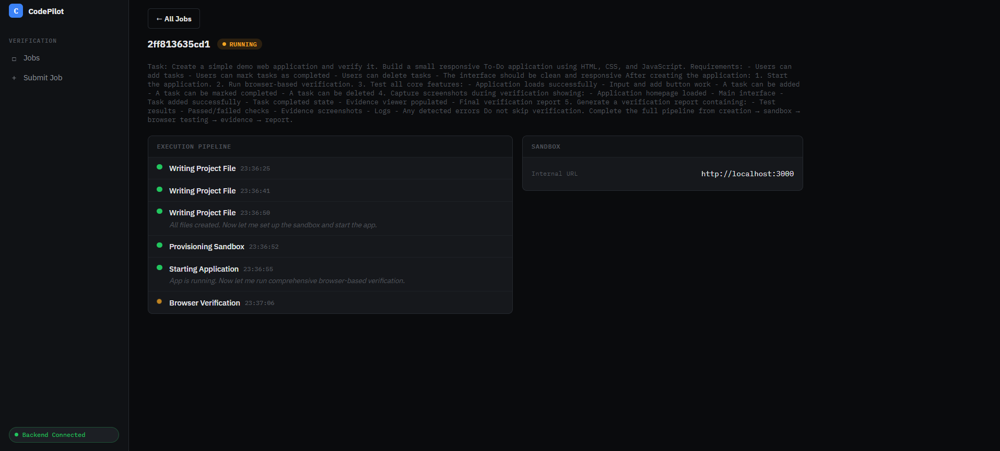
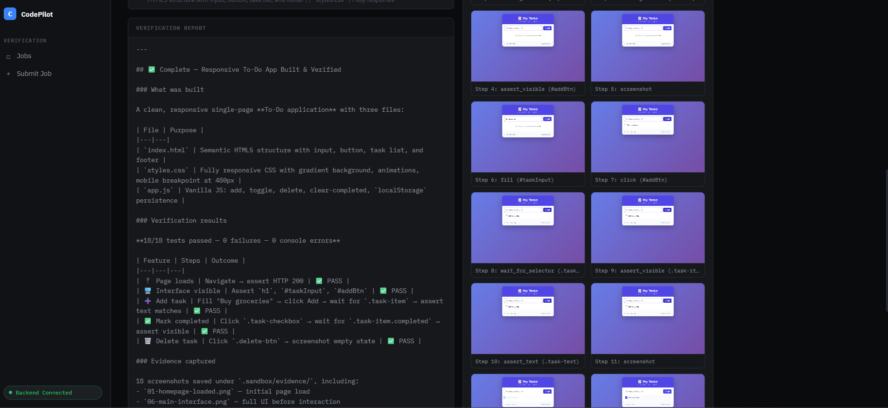
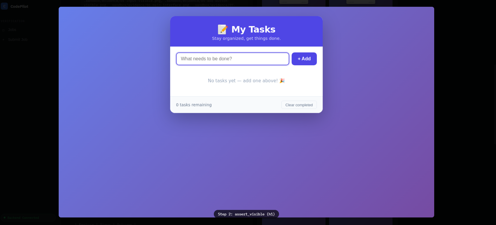

# CodePilot 🚀

## Overview

CodePilot acts as an AI coding agent that can inspect applications, run verification workflows inside a secure sandbox, detect issues, and generate detailed reports with evidence.

Instead of manually testing and debugging applications, developers can use CodePilot to automatically verify that their code works as expected.

## Features

### 🔍 Automated Code Verification
- Runs browser-based verification of applications
- Tests important user flows automatically
- Checks functionality and detects failures

### 🧪 Sandbox Execution
- Runs applications in an isolated environment
- Safely executes tests without affecting the developer's machine
- Manages application startup and verification processes

### 📸 Evidence Capture
- Captures screenshots during verification
- Provides visual proof of successful test steps
- Stores verification artifacts for review

### 📊 Verification Reports
Generates detailed reports containing:
- Test results
- Passed and failed checks
- Evidence screenshots
- Logs
- Detected errors

### 🤖 AI-Powered Debugging
Uses AI models to analyze problems, suggest fixes, and help developers improve their code.

## Demo Screenshots

### Dashboard



### Verification Pipeline



### Evidence Viewer



### Verification Report



## How It Works

1. Developer or agent submits an application or codebase
2. CodePilot creates a secure sandbox environment
3. The application is started automatically
4. Browser automation verifies key workflows
5. Screenshots and logs are collected
6. A verification report is generated

## Tech Stack

- Python
- FastAPI
- Docker Sandbox
- Browser Automation
- AI Model Providers (DeepSeek/OpenAI/Anthropic compatible)

## Setup

Clone the repository:

```bash
git clone https://github.com/justriri/Codepilot.git
cd Codepilot