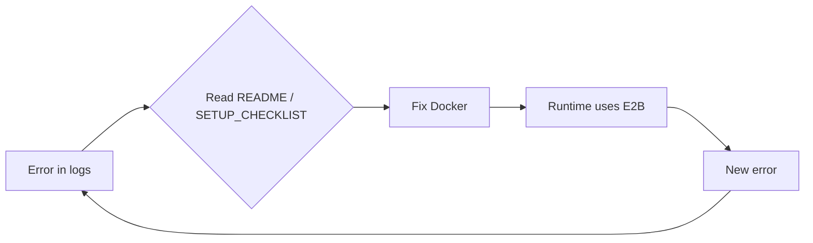
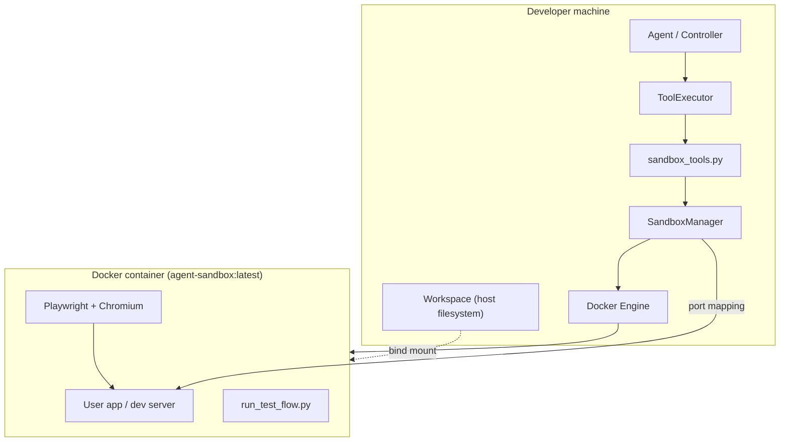
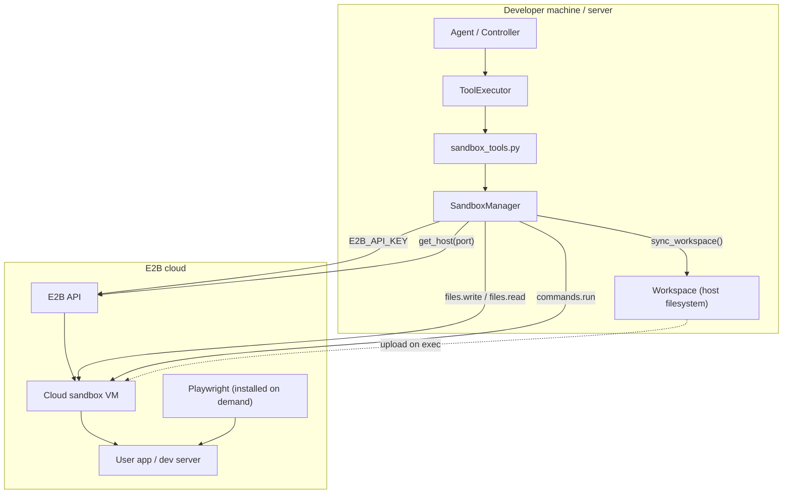
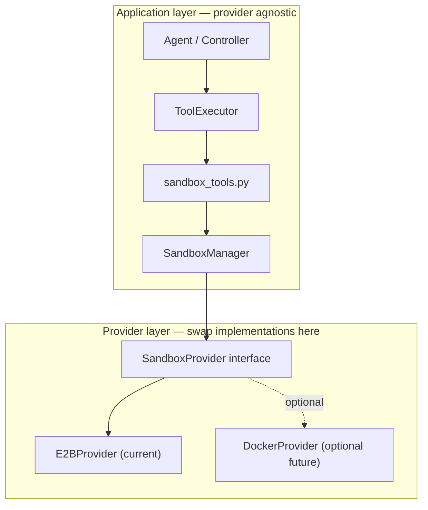
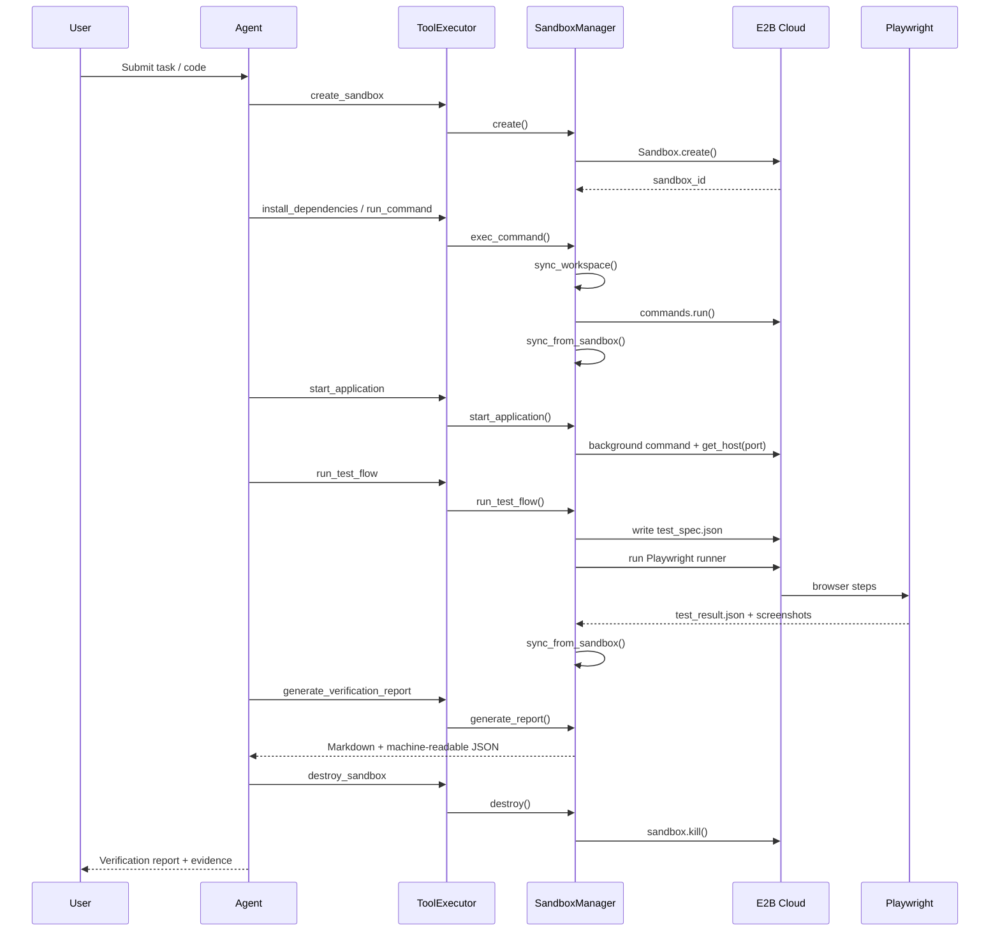
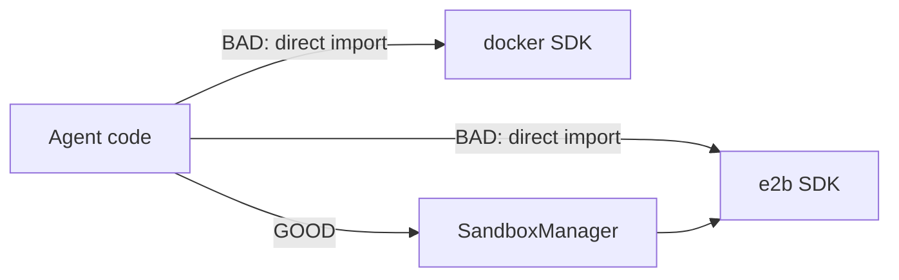

# CodePilot Sandbox Architecture

This document describes how CodePilot runs code in an isolated environment: the original Docker setup, the current E2B implementation, and the intended provider boundary.

If sandbox errors keep shifting after each fix, start here. The runtime already uses E2B — stale Docker references in docs and config are a common cause of confusion.

---

## Table of contents

1. [The problem: partial migration](#the-problem-partial-migration)
2. [Before: Docker-based sandbox](#before-docker-based-sandbox)
3. [Now: E2B cloud sandbox](#now-e2b-cloud-sandbox)
4. [Target: clean provider boundary](#target-clean-provider-boundary)
5. [Request flow (step by step)](#request-flow-step-by-step)
6. [Component responsibilities](#component-responsibilities)
7. [What changed in the migration](#what-changed-in-the-migration)
8. [Setup and verification](#setup-and-verification)
9. [Troubleshooting](#troubleshooting)
10. [Future: adding another provider](#future-adding-another-provider)

---

## The problem: partial migration

CodePilot originally used **Docker on the developer's machine** to run agent-generated code. That required Docker Desktop, a custom sandbox image, bind mounts, and port mapping.

The project was migrated to **E2B** (cloud sandboxes via API) so agents could run code without local Docker. The **core runtime** (`SandboxManager`) was updated, but many **docs, config fields, test scripts, and comments** still described Docker.

That mismatch sends you down the wrong debugging path:



**Symptoms of partial migration:**

- `verify_docker_connection.py` passes but `create_sandbox` still fails
- `.env` has `DOCKER_IMAGE` but runtime needs `E2B_API_KEY`
- Error messages say "Is Docker running?" when Docker is irrelevant
- Patching one error at a time without finishing the migration

**Fix:** finish the migration at the **documentation and config layer**, then debug only through the E2B path.

---

## Before: Docker-based sandbox

In the original design, the host machine ran a Docker daemon. `SandboxManager` created a container from a pre-built image, bind-mounted the workspace, and executed commands inside it.



### How Docker sandbox worked

| Step | What happened |
|------|----------------|
| **create** | `docker run` with `agent-sandbox:latest`, workspace mounted |
| **exec** | `docker exec` into running container |
| **start app** | Background process inside container; map container port → host port |
| **sync files** | Bind mount — host files visible instantly inside container |
| **screenshots** | Playwright runs inside container; files written to mounted `.sandbox/` |
| **destroy** | `docker rm -f` |

### Docker requirements (old)

- Docker Desktop / `dockerd` running locally
- `docker build -t agent-sandbox:latest ./sandbox`
- `DOCKER_IMAGE` in `.env`
- No cloud API key for sandbox itself

### Why Docker was replaced

- Agents couldn't run sandboxes on machines without Docker
- Image builds and Chromium installs were slow and fragile
- Port mapping and bind mounts differ across OS environments
- Cloud sandboxes (E2B) provide API-based create/exec/destroy without local infra

---

## Now: E2B cloud sandbox

The **current production path** uses [E2B](https://e2b.dev). `SandboxManager` calls `Sandbox.create()` and uses E2B's command, filesystem, and port-exposure APIs.



### How E2B sandbox works today

| Step | What happens |
|------|----------------|
| **create** | `Sandbox.create()` via E2B API |
| **exec** | `sandbox.commands.run(cmd, cwd=workdir)` |
| **start app** | Background command; `sandbox.get_host(port)` for public URL |
| **sync files** | `sync_workspace()` uploads host files via `sandbox.files.write` |
| **sync back** | `sync_from_sandbox()` downloads `.sandbox/*` artifacts to host |
| **screenshots** | Playwright inside E2B VM; results synced to host workspace |
| **destroy** | `sandbox.kill()` |

### E2B requirements (current)

```bash
# .env
E2B_API_KEY=your_key_here
SANDBOX_TTL_S=600   # optional watchdog timeout
```

Verify before running the full pipeline:

```bash
python verify_e2b_connection.py
```

**You do not need Docker Desktop for the runtime path.**

> **Note:** `sandbox/Dockerfile` is **legacy**. It was used to build the old local Docker image. E2B sandboxes are provisioned by E2B's template system, not by building this Dockerfile on your machine.

---

## Target: clean provider boundary

The migration is **complete** when only `SandboxManager` (or a thin provider adapter behind it) knows which backend is used. Everything else talks to a stable interface.



### Target interface (conceptual)

Every provider should implement the same lifecycle:

```
create()              → { success, sandbox_id, status }
destroy()             → { success, status }
exec_command(cmd)     → { success, exit_code, stdout, stderr }
start_application()   → { success, exposed_url, internal_url, ... }
stop_application()    → { success }
run_test_flow()       → { success, steps, screenshots, ... }
generate_report()     → { success, report_path, overall_result, ... }
```

### Rules

1. **Agents never import** `docker`, `e2b`, or any provider SDK directly.
2. **ToolExecutor** only calls `SandboxManager` methods (via `sandbox_tools.py`).
3. **Config** documents the active provider (`E2B_API_KEY`), not dead Docker fields.
4. **Health checks** match the provider (`verify_e2b_connection.py`, not Docker).
5. **Docs and UI copy** match the provider — no mixed messaging.

Today, `SandboxManager` **is** the provider implementation (E2B inlined). A future refactor could extract `E2BProvider` class without changing the agent layer.

---

## Request flow (step by step)

Full verification pipeline from user submission to report:



---

## Component responsibilities

| Component | Path | Role |
|-----------|------|------|
| **Controller** | `agent/controller.py` | Agent loop: plan → tool calls → observe |
| **ToolExecutor** | `agent/tools/executor.py` | Single dispatch table for all tools |
| **sandbox_tools** | `agent/tools/sandbox_tools.py` | Thin adapters: unpack tool input → call manager |
| **SandboxManager** | `agent/sandbox/manager.py` | **Only place that talks to E2B SDK** |
| **Workspace** | `agent/workspace.py` | Host-side file storage for agent edits |
| **Definitions** | `agent/tools/definitions.py` | Tool schemas the LLM sees |
| **DebuggingAgent** | `agent/agents/debugging_agent.py` | Runs on **host**; analyzes failures, proposes fixes |
| **Session manager** | `server/session_manager.py` | One workspace + one sandbox per web session |

### What must NOT happen



---

## What changed in the migration

| Area | Before (Docker) | After (E2B) |
|------|-----------------|-------------|
| Sandbox creation | `docker run` + custom image | `Sandbox.create()` |
| File sync | Bind mount | `sync_workspace()` / `files.write` |
| Command execution | `docker exec` | `sandbox.commands.run()` |
| Port exposure | Docker port mapping | `sandbox.get_host(port)` |
| Health check | `verify_docker_connection.py` | `verify_e2b_connection.py` |
| Env vars | `DOCKER_IMAGE`, mem/cpu limits | `E2B_API_KEY`, `SANDBOX_TTL_S` |
| Local requirement | Docker Desktop | E2B API key only |
| Playwright | Baked into Docker image | Installed on first test run in E2B VM |

### Files updated in this cleanup

- Removed `verify_docker_connection.py` → added `verify_e2b_connection.py`
- Updated `.env.example`, `agent/config.py`, `README.md`, `SETUP_CHECKLIST.md`
- Updated stale Docker comments in server and agent modules
- Updated UI copy in `server/static/index.html`

---

## Setup and verification

### 1. Install dependencies

```bash
python -m venv .venv
source .venv/bin/activate
pip install -r requirements.txt
```

### 2. Configure environment

```bash
cp .env.example .env
```

Required for sandbox:

```
E2B_API_KEY=your_key_here
```

Required for AI (pick your provider):

```
DEFAULT_MODEL=deepseek
DEEPSEEK_API_KEY=...
```

### 3. Verify E2B (do this first)

```bash
python verify_e2b_connection.py
```

### 4. Verify AI provider (optional, fast)

```bash
python test_deepseek_connection.py
```

### 5. Run end-to-end pipeline

```bash
python test_e2e_pipeline.py
```

---

## Troubleshooting

| Symptom | Likely cause | Fix |
|---------|--------------|-----|
| `E2B sandbox creation failed` | Missing or invalid `E2B_API_KEY` | Set key in `.env`; run `verify_e2b_connection.py` |
| "Is Docker running?" in old docs/errors | Stale migration artifacts | Ignore Docker; use E2B path (this doc) |
| `No active sandbox. Call create_sandbox first` | Agent skipped `create_sandbox` tool | Ensure tool order: create → install → start → test |
| `Test runner did not produce a result file` | Playwright install failed in E2B VM | Check runner stdout/stderr in tool result; retry with longer timeout |
| Port exposure failed | App didn't bind to expected port | Read `.sandbox/app.log` via `read_file` |
| Every AI fix breaks something else | Patching symptoms, not architecture | Stop; read this doc; fix provider boundary first |

---

## Future: adding another provider

If you want Docker back (local dev) or Daytona/Modal:

1. Define `SandboxProvider` protocol with the lifecycle methods above.
2. Move E2B code from `SandboxManager` into `providers/e2b_provider.py`.
3. `SandboxManager` becomes a facade that picks provider from config:

```python
# conceptual — not yet implemented
SANDBOX_PROVIDER=e2b   # or docker, daytona
```

4. Agents, ToolExecutor, and sandbox_tools **do not change**.

---

## Summary

| Question | Answer |
|----------|--------|
| Is the sandbox provider broken? | Unlikely — check `E2B_API_KEY` first |
| Is the architecture broken? | It was **inconsistent** after partial migration |
| What runs sandboxes today? | `SandboxManager` → E2B API only |
| Do I need Docker? | **No** for the current runtime path |
| What should I debug? | E2B connectivity → create_sandbox → exec → test flow → report |
| What should agents never do? | Import Docker or E2B directly |

For a linear setup checklist, see [SETUP_CHECKLIST.md](../SETUP_CHECKLIST.md).
